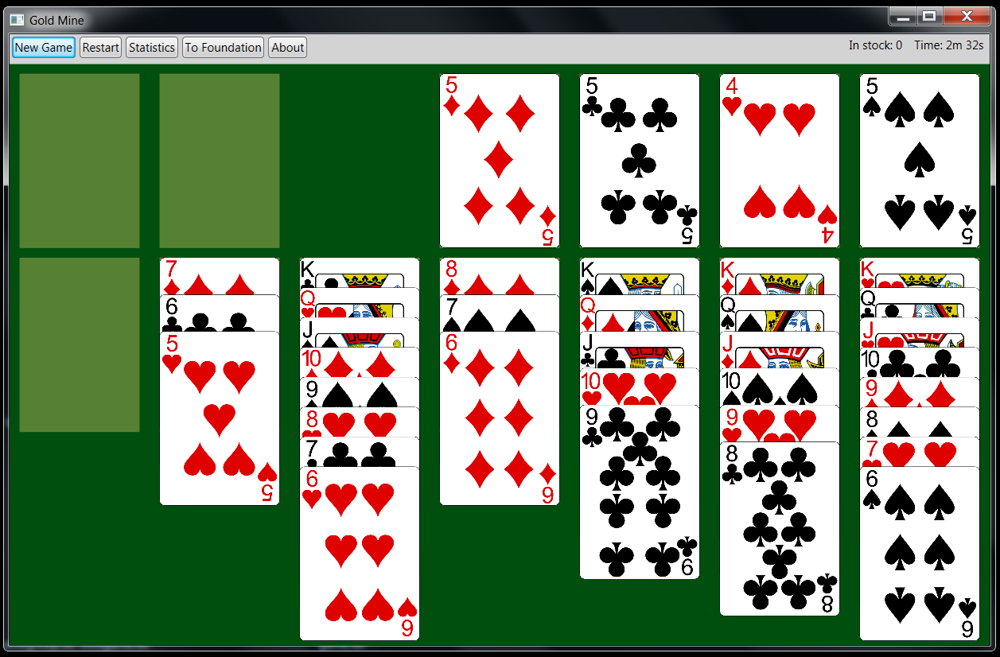



Gold Mine
=========

You can read about the game here [http://politaire.com/help/goldmine](http://politaire.com/help/goldmine).

- The game starts with all the cards in the stock (top left).
- Clicking on the stock moves 3 cards to the waste (element next to the stock).
- You can then move the last card there to either the tableau of the foundation.
- There's only one pass through the stock, so you need to keep combining the cards until you move through all the cards available.
- You can move any card to an empty tableau (bottom), or move to a stack there if a card is of alternating color and one value lower.
- The goal of the game is to move all the cards to the foundation (top right).
- A card may be moved to a foundation is its either an ace, or a card of the same suit with one higher value.
- So basically, keep combining the cards in the tableau (bottom), try not to use all the available empty tableaus (they are useful to make the combinations).
- As possible, you need to keep filling the foundation as well, starting with the ace and going from there.
- If you manage to move all the cards to the foundation (four stacks from ace to king) then you'll win the game.

FreeCell
========

- [http://politaire.com/help/freecell](http://politaire.com/help/freecell)

Shortcuts
=========

You can click on the `alt` key to see an highlight of the key shortcut on the main menu.

- `alt + s` -- Open the `Select Game` sub-menu.
    - `+ f` -- `F`reeCell.
    - `+ g` -- `G`old Mine.
    - `+ k` -- `K`londike.
- `alt + n` -- Start a `n`ew game.
- `alt + r` -- `R`estart the same game.
- `alt + o` -- Open the `other` sub-menu.
    - `+ s` -- Open the `s`tatistics window.
    - `+ h` -- Open the `h`elp window.
    - `+ a` -- Open the `a`bout window.
- `alt + f` -- Try to move all the possible cards from the waste/tableau to the `f`oundation (available on some games).

Also, double-clicking on a card will attempt to move it to the foundation (if it is possible within the rules of the game).

Images
======

- cards images : 1.3
    - https://code.google.com/p/vector-playing-cards/
    - public domain

- cards back
    - http://opengameart.org/content/colorful-poker-card-back
    - license: CC-BY 3.0 (Attribution 3.0 Un-ported)
